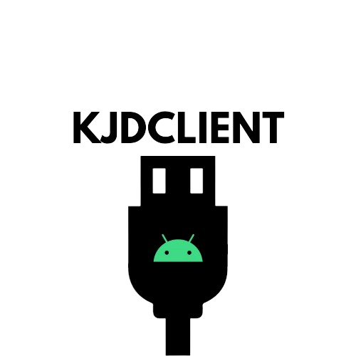

    

    
    

# 💬 KJDClient
KJDClient! The Evolution of AnDroid JaM.

# 📌 Information
- Written in C# (.NET Framework 4.7.2)
- We support: Nexus 5 and Ideos U8150
- I you want to suggest a rom, go to the channel #suggestions on our server discord!
TWRP HH and Normal for the Nexus 5.
- Made for downloading roms in general

# 📌 Features
- Download Roms ✅
- Download TWRP for the Nexus 5 ✅
- Download ClockWorkMod Recovery for Ideos U8150 ❎
- Minimalistic Graphics ✅

# 💬 Discord
- https://discord.gg/ktQxDykQ3K

